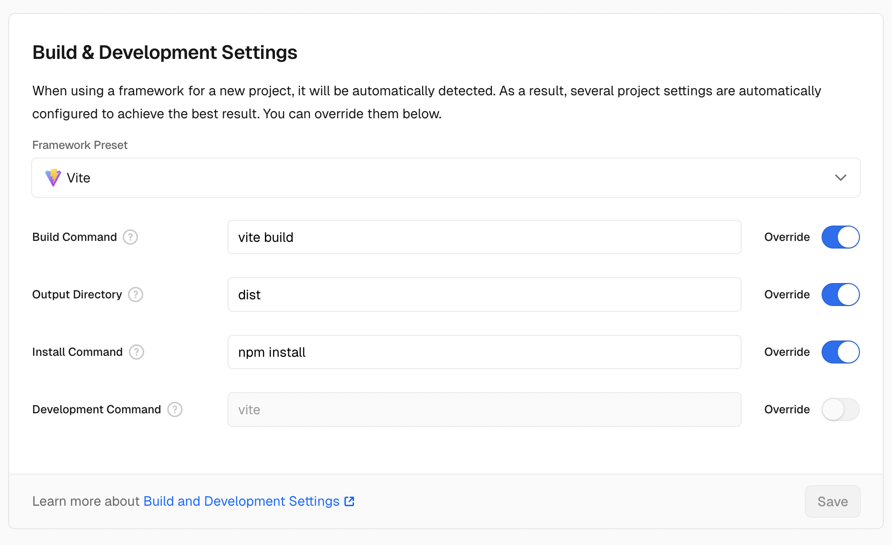

<div align="center">
  
# MixUi Pixiv Viewer

基于 Pixiv Api 数据驱动的的 React、TS、TailwindCSS 项目，混合了 Aceternity/Shadcn/radix UI.


[](https://vercel.com/new/clone?repository-url=https://github.com/inokoe/MixUI-Pixiv-Viewer&demo-title=MuiPixivViewer)


</div>

## 快速部署

该项目接口依赖于 Vercel，因此，您可以通过 Vercel 快速部署您自己的服务



## 本地运行

在本地运行 Vercel Server

```bash
npm install
npm run serve
```

## 特性

### 页面特性

> 该项目是基于 Pixiv Api 的简单实现，包含了以下页面特性

- [x] 首页
  - [x] 插画日、周、月排行榜
  - [x] 搜索页面
  - [x] 作品详情页
- [x] 性能监控
  - [x] 图片性能监控
  - [x] 接口性能监控
  - [x] IP 信息与定位
- [x] 历史
  - [x] 近期浏览历史
- [x] 设置
  - [x] 开发模式
  - [x] 安全模式
  - [x] 图片质量自适应
  - [x] CDN 分流
- [x] 关于项目

### 代理特性

#### API 反向代理

> 作为一个纯前端项目，后端 Api 服务依赖于 Vercel 进行反向代理

Request => Vercel => Original Server

#### 图片代理

> 图片代理分为 Vercel 代理与 Cloudflare Worker 代理

- Vercel 每个月提供了 100G 的高速流量额度.

  > 在 Vercel 部署后，在项目的 `Setting => Functions => Advanced Settings => Function Region` 将地区选择为 `Japan Tokyo`。

- CloudFlare Worker 每日 10 万次请求额度
  > 已经预设了经过 CNAME 优选后的 Cloudflare 多域名分流。

若您想要自己部署，使用 Worker 代码：

```js
export default {
  async fetch(request) {
    const url = new URL(request.url);
    url.hostname = 'i.pximg.net';

    const proxyRequest = new Request(url, request);
    proxyRequest.headers.set('Referer', 'https://www.pixiv.net/');

    const response = await fetch(proxyRequest);
    const newHeaders = new Headers(response.headers);

    // 添加 CORS 头
    newHeaders.set('Access-Control-Allow-Origin', '*');
    newHeaders.set('Access-Control-Allow-Methods', 'GET');
    newHeaders.set(
      'Access-Control-Allow-Headers',
      'Content-Type, Authorization'
    );

    return new Response(response.body, {
      status: response.status,
      statusText: response.statusText,
      headers: newHeaders,
    });
  },
};
```

## 参考

### Pixiv Api

https://github.com/mixmoe/HibiAPI

### Pixiv Viewer

https://github.com/FreeNowOrg/PixivNow  
https://github.com/journey-ad/pixiv-viewer  
https://github.com/asadahimeka/pixiv-viewer

## 特别说明

- 本项目仅供学习交流使用，请勿用于商业用途
- 请注重版权问题，本项目仅供学习交流使用，版权归 Pixiv 所有
